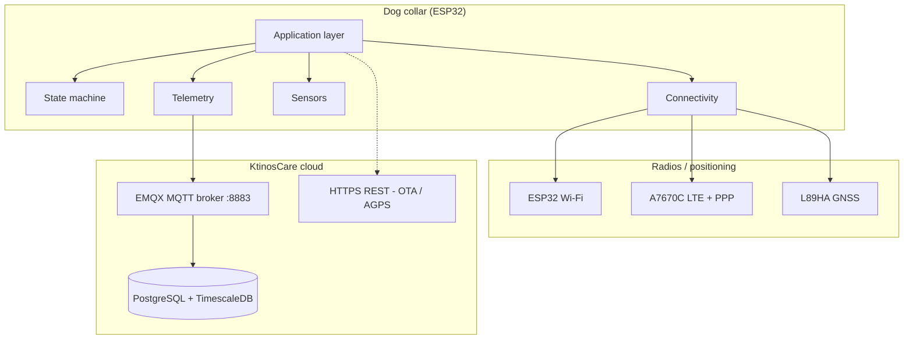
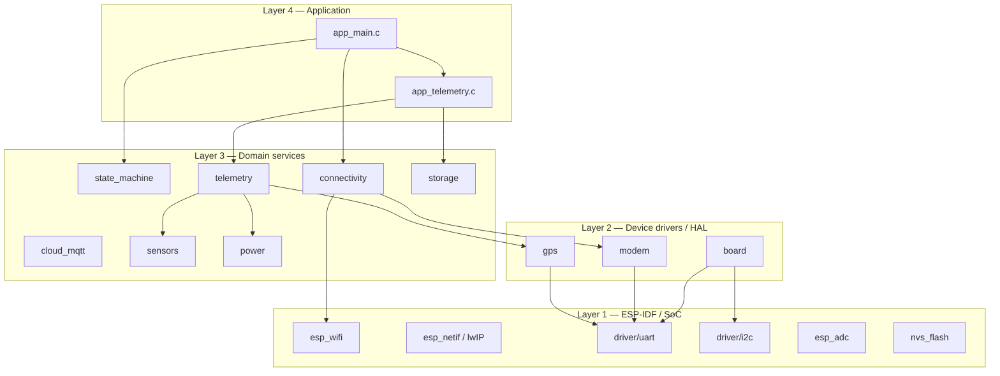
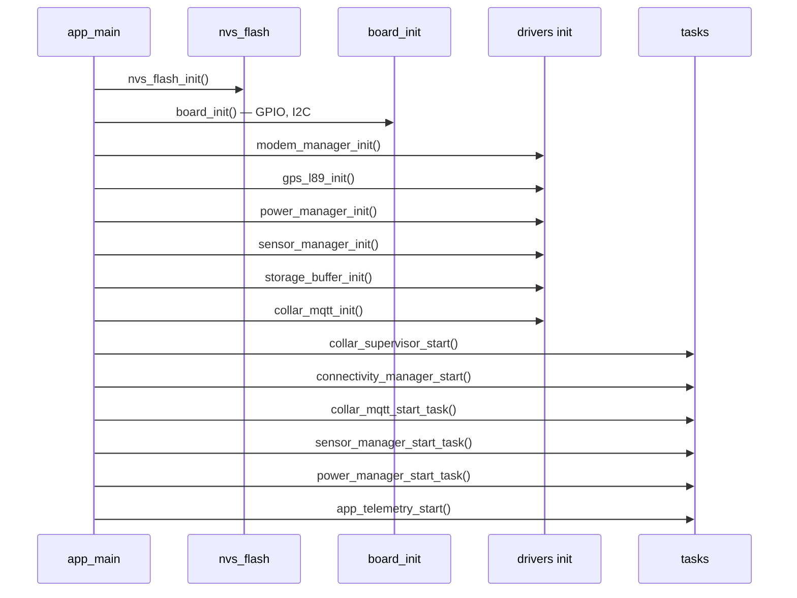
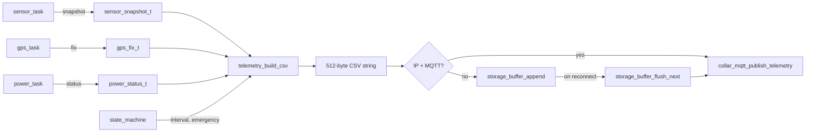

# System Architecture

## 1. Purpose

The **KtinosCare dog health collar** is a battery-powered ESP32-WROOM wearable that:

- Samples vitals (PPG heart rate, respiration trend, skin temperature, IMU activity, ambient light)
- Determines location (L89HA GNSS when Wi-Fi is unavailable)
- Uploads telemetry to a cloud backend over **TCP/IP** (MQTT over TLS on port 8883)
- Prioritizes **Wi-Fi** and falls back to **4G LTE (PPP)** via the A7670C modem
- Uses a **modular FreeRTOS architecture** with an explicit **state machine** for operational modes

This firmware implements the architecture described in the SRS and cloud integration specification. Several subsystems are **scaffolded** (stubs with clear TODO hooks) so drivers and cloud logic can be added without restructuring tasks or states.

---

## 2. System context



---

## 3. Layered software design



### Design principles

1. **Event-driven state machine** — Operational mode changes are centralized; tasks post events instead of mutating global mode flags ad hoc.
2. **Wi-Fi-first connectivity** — Cellular modem and GPS are gated when Wi-Fi is the active link (SRS FR-10a).
3. **Component boundaries** — Each ESP-IDF `components/` folder is a linkable unit with a narrow public API in `include/`.
4. **Cloud contract isolation** — CSV field order and MQTT topic strings live in `telemetry/` and `cloud_mqtt/` respectively.

---

## 4. Repository layout

```
prj_code/
├── main/                          # Application entry + telemetry orchestration
│   ├── app_main.c                 # Boot, init order, start all tasks
│   ├── app_telemetry.c            # CSV build, buffer flush, GPS/modem side-effects
│   └── include/collar_tasks.h     # Task map reference
├── components/
│   ├── board/                     # GPIO, I2C bus, pin constants
│   ├── state_machine/             # States, events, supervisor task
│   ├── connectivity/              # Wi-Fi manager + failover policy
│   ├── modem/                     # A7670 power + PPP (stub)
│   ├── gps/                       # L89HA UART + NMEA (partial)
│   ├── cloud_mqtt/                # MQTT session (stub)
│   ├── telemetry/                 # CSV frame builder
│   ├── sensors/                   # Sensor aggregation (stub)
│   ├── power/                     # Battery ADC
│   └── storage/                   # Offline queue (stub)
├── partitions.csv                 # factory, OTA, certs, SPIFFS storage
├── sdkconfig.defaults
└── docs/                          # This documentation set
```

---

## 5. Boot and initialization sequence

`app_main()` performs initialization in dependency order, then starts FreeRTOS tasks.



**Source:** `main/app_main.c`

| Step | Function | Responsibility |
|------|----------|----------------|
| 1 | `nvs_flash_init()` | Configuration, Wi-Fi credentials, device UID (future) |
| 2 | `board_init()` | Output pins (modem/GPS power), I2C master bus |
| 3 | `modem_manager_init()` | UART1 for A7670 AT/PPP |
| 4 | `gps_l89_init()` | UART2 for L89 NMEA |
| 5 | `power_manager_init()` | ADC1 for battery divider |
| 6 | `sensor_manager_init()` | Placeholder for I2C sensor drivers |
| 7 | `storage_buffer_init()` | Placeholder for SPIFFS ring buffer |
| 8 | `collar_mqtt_init()` | Placeholder for mTLS client config |
| 9+ | `*_start()` / `*_start_task()` | Create FreeRTOS tasks |

---

## 6. Runtime data flow (telemetry path)



**Key function:** `telemetry_build_csv()` in `components/telemetry/telemetry_csv.c`

---

## 7. Connectivity hierarchy

Aligned with SRS FR-9, FR-10, FR-10a and integration spec §1:

| Priority | Interface | Hardware | TCP/IP path | When active |
|----------|-----------|----------|-------------|-------------|
| 1 | Wi-Fi STA | ESP32 internal | `esp_netif` default STA | Home / known AP available |
| 2 | LTE PPP | A7670C | lwIP PPP netif (TODO) | Wi-Fi down ≥ `BOARD_WIFI_FAIL_THRESHOLD_MS` (3 min) |
| GNSS | L89HA UART | L89HA | N/A (position only) | Wi-Fi lost; not used when Wi-Fi connected |

**Policy enforcement:**

- `connectivity_manager.c` — detects Wi-Fi, starts PPP, posts state events
- `collar_state_machine_modem_allowed()` / `gps_allowed()` — return `false` when `s_link == COLLAR_LINK_WIFI`
- `app_telemetry.c` — calls `modem_manager_power_off()` on `WIFI_CONNECTED`

---

## 8. State machine (summary)

Eight operational states map to SRS §5. Full transition tables: [STATE_MACHINE.md](./STATE_MACHINE.md).

| State | Meaning |
|-------|---------|
| `OFF` | Shipping / storage |
| `DEEP_SLEEP` | Low-power idle |
| `SENSOR_SAMPLING` | Normal vitals acquisition |
| `WIFI_CONNECTED` | Wi-Fi up; modem/GPS off |
| `LTE_TRANSMISSION` | PPP active |
| `GNSS_ACQUISITION` | L89HA fix in progress |
| `EMERGENCY_ALARM` | 5-minute reporting override |
| `CHARGING` | USB / charger present |

---

## 9. Flash partition strategy

From `partitions.csv`:

| Partition | Type | Purpose |
|-----------|------|---------|
| `nvs` | data | Runtime config, Wi-Fi SSID |
| `factory` / `ota_0` | app | Dual-slot OTA (future HTTPS OTA) |
| `certs` | data | Factory-provisioned X.509 client cert (mTLS) |
| `storage` | spiffs | Offline CSV ring buffer (7-day target per spec) |

---

## 10. Implementation status matrix

| Module | Status | Next implementation step |
|--------|--------|---------------------------|
| `board` | **Partial** | Confirm GPIO vs schematic; add MAX30102/LSM6DSOX/OPT3001 I2C devices |
| `state_machine` | **Complete** (core logic) | Wire deep sleep, charger detect events |
| `connectivity` | **Partial** | NVS Wi-Fi credentials; real PPP success detection |
| `modem` | **Stub** | Integrate `esp_modem`, AT dial-up, `esp_netif` PPP |
| `gps` | **Partial** | NMEA lat/lon conversion; AGPS from REST API |
| `cloud_mqtt` | **Stub** | `esp_mqtt_client` + mTLS + LWT + backoff |
| `telemetry` | **Partial** | Full CSV index alignment; SpO2, DHT fields |
| `sensors` | **Stub** | Real drivers + adaptive sampling (SRS FR-5) |
| `power` | **Partial** | Charger GPIO, post `BATTERY_*` events |
| `storage` | **Stub** | SPIFFS circular log on `storage` partition |

---

## 11. Extension guidelines

When adding a feature:

1. **Post an event** to the state machine if it changes operational mode (`collar_state_machine_post_event`).
2. **Do not** start the modem or GPS from multiple places — use `connectivity_manager` or `app_telemetry` side-effects.
3. **Keep CSV changes** backward-compatible with the cloud parser (fixed index order in integration spec §4.4).
4. **Add a component** rather than growing `app_main.c` — register in `CMakeLists.txt` and call init from `app_main`.

See [COMPONENT_IMPLEMENTATION.md](./COMPONENT_IMPLEMENTATION.md) for file-level detail.
