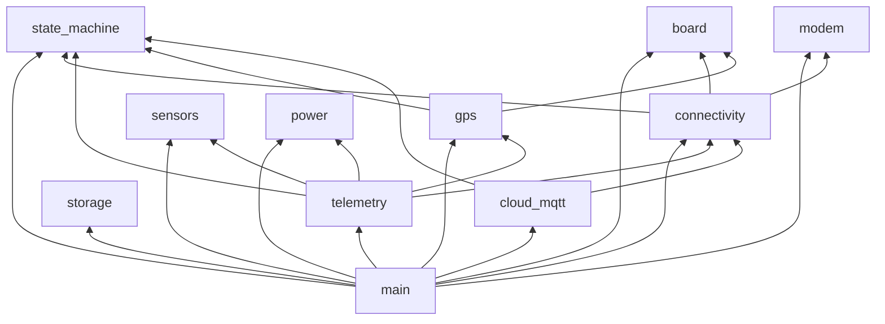

# Component Implementation Reference

Per-module guide: public API, source files, call graph, and implementation notes.

---

## 1. `main` — Application layer

### `app_main.c`

**Role:** Single entry point after ESP-IDF startup.

| Function | Calls |
|----------|-------|
| `app_main()` | NVS → board → modem → gps → power → sensors → storage → mqtt init |
| | `collar_supervisor_start()` |
| | `connectivity_manager_start()` |
| | `collar_mqtt_start_task()` |
| | `sensor_manager_start_task()` |
| | `power_manager_start_task()` |
| | `app_telemetry_start()` |

**Error handling:** `ESP_ERROR_CHECK()` on all init — fails fast on bring-up.

---

### `app_telemetry.c`

**Role:** Orchestrates CSV production and uplink; reacts to state for GPS/modem.

| Function | Description |
|----------|-------------|
| `on_state_change()` | On `GNSS_ACQUISITION` → `gps_l89_start_task()`; on `WIFI_CONNECTED` → `modem_manager_power_off()` |
| `telemetry_task()` | Main loop: build CSV, publish or buffer, sleep |
| `app_telemetry_start()` | `xTaskCreatePinnedToCore(..., Core 1)` |

**Buffered flush rate:** `60000 / STORAGE_FLUSH_RATE_PER_MIN` ms between historical rows (spec: max 5/min).

---

## 2. `board` — Hardware abstraction

### Files

| File | Purpose |
|------|---------|
| `include/board_pins.h` | All `#define` GPIO/UART/I2C constants |
| `include/board_init.h` | `board_init()`, `board_get_i2c_bus()` |
| `board_init.c` | GPIO config + `i2c_new_master_bus()` |

### `board_init()` behavior

1. Configure outputs: `TEMP_VDD` (`GPIO26`), `GSM_RST` (`GPIO27`), `POWER_HOLD` (`GPIO23`), `GPS_RST` (`GPIO18`), `VBAT_ADC_ON` (`GPIO5`)
2. Configure inputs with pull-up: `LIGHT_INIT` (`GPIO25`), `MEMS_INIT` (`GPIO33`), `RESP_INT` (`GPIO32`)
3. Create I2C master: SDA=21, SCL=22, 400 kHz

### Extension: add sensor device handles

```c
// Future in board_init.c or sensors/
i2c_device_config_t max30105_cfg = {
    .dev_addr_length = I2C_ADDR_BIT_LEN_7,
    .device_address = 0x57,
    .scl_speed_hz = BOARD_I2C_FREQ_HZ,
};
i2c_master_dev_handle_t max30105;
i2c_master_bus_add_device(s_i2c_bus, &max30105_cfg, &max30105);
```

---

## 3. `state_machine`

See [STATE_MACHINE.md](./STATE_MACHINE.md).

### Public API summary

```c
esp_err_t collar_state_machine_init(const collar_state_machine_config_t *cfg);
esp_err_t collar_state_machine_post_event(const collar_event_t *evt, TickType_t wait_ticks);
esp_err_t collar_state_machine_process(TickType_t wait_ticks);
collar_state_t collar_state_machine_get_state(void);
collar_link_t collar_state_machine_get_link(void);
uint32_t collar_state_machine_get_report_interval_sec(void);
bool collar_state_machine_gps_allowed(void);
bool collar_state_machine_modem_allowed(void);
```

---

## 4. `connectivity`

### `wifi_manager.c`

| API | Status |
|-----|--------|
| `wifi_manager_init()` | Creates default event loop, STA netif, registers handlers |
| `wifi_manager_start()` | `WIFI_MODE_STA`, `esp_wifi_start()`, auto-reconnect on disconnect |
| `wifi_manager_is_connected()` | `true` after `IP_EVENT_STA_GOT_IP` |
| `wifi_manager_get_rssi()` | From `esp_wifi_sta_get_ap_info()` |

**TODO:** Load `wifi_config_t` from NVS or `CONFIG_COLLAR_WIFI_*` Kconfig symbols in `main/Kconfig.projbuild`.

### `connectivity_manager.c`

| Static state | Meaning |
|--------------|---------|
| `s_has_ip` | Abstract “TCP/IP ready” (Wi-Fi or PPP) |
| `s_wifi_down_since_us` | `esp_timer_get_time()` when Wi-Fi lost |

**Failover threshold:** `BOARD_WIFI_FAIL_THRESHOLD_MS` in `board_pins.h` (180000 ms = 3 min).

---

## 5. `modem` — A7670E

### Reset / UART sequence (`modem_manager_power_on`)

```text
GSM_RST (GPIO27) = 0  (assert reset)
delay 200 ms
GSM_RST           = 1  (release)
delay BOARD_MODEM_BOOT_MS (8000 ms)
```

`TEMP_VDD` (`GPIO26`) is reserved for the thermistor rail, and `POWER_HOLD` (`GPIO23`) is treated as a board-level hold signal.

### PPP (`modem_manager_start_ppp`) — stub

Current code sets `s_ppp_up = true` without AT commands.

**Production integration checklist:**

1. Add `idf_component.yml` dependency on `espressif/esp_modem`
2. Configure UART1 pins from `board_pins.h`
3. Set APN from `CONFIG_COLLAR_LTE_APN`
4. On PPP `IP_EVENT`, call same path as Wi-Fi: post `PPP_CONNECTED`, set default netif
5. On Wi-Fi restore: `modem_manager_stop_ppp()` then `power_off()`

---

## 6. `gps` — L89HA

### UART

- Port: `UART_NUM_2`, 9600 baud, TX=19, RX=18

### `gps_task` algorithm

1. Line-buffer UART RX on `\n`/`\r`
2. `parse_gga()` — minimal `$GNGGA` / `$GPGGA` quality + lat/lon (degrees as raw NMEA — **needs conversion to decimal degrees**)
3. On fix → `collar_state_machine_post_event(GPS_FIX)`
4. On timeout → `GPS_TIMEOUT`

### `gps_l89_get_last_fix()`

Returns last `gps_fix_t`; used by `telemetry_build_csv()`.

---

## 7. `sensors`

### `sensor_snapshot_t`

```c
typedef struct {
    float avg_heart_rate, min_heart_rate, max_heart_rate;
    float avg_skin_temp, max_skin_temp;
    float accel_x, accel_y, accel_z;
    bool motion_detected;
    float light_lux;
    uint32_t total_steps;
} sensor_snapshot_t;
```

### `sensor_task` (stub)

Fills placeholder values; real implementation:

| Sensor | Bus | Part | SRS |
|--------|-----|------|-----|
| PPG | I2C | MAX30105 | FR-1, FR-2 |
| IMU | I2C | LSM6DSOX | FR-3, FR-5 |
| ALS | I2C | OPT3001 | FR-5a |
| Skin temp | ADC | Thermistor → `TEMP_ADC` | FR-4 |

Use `MEMS_INT`, `RESP_INT`, `LIGHT_INT` GPIOs for interrupt-driven sampling when motion detected.

---

## 8. `power`

### ADC

- Unit: `ADC_UNIT_1`, channel `ADC_CHANNEL_7` (GPIO35)
- Enables divider via `VBAT_ADC_ON` (GPIO33) before read
- Voltage scale: `(raw/4095)*3.3*2.2` — **calibrate divider resistors R26/R27 from schematic**

### Classification

| State | Threshold (stub) |
|-------|------------------|
| FULL | ≥ 4.10 V |
| NORMAL | ≥ 3.70 V |
| LOW | ≥ 3.50 V |
| CRITICAL | < 3.50 V |

---

## 9. `telemetry`

### `telemetry_build_csv()`

Aggregates:

- `sensor_manager_get_snapshot()`
- `gps_l89_get_last_fix()`
- `power_manager_get_status()`
- `collar_state_machine_is_emergency()`, `get_report_interval_sec()`
- `connectivity_manager_get_rssi()`

Output: single line ≤ `TELEMETRY_CSV_MAX_BYTES` (512).

**Index order** must match integration spec §4.4 — see [CONNECTIVITY_AND_CLOUD.md](./CONNECTIVITY_AND_CLOUD.md).

---

## 10. `cloud_mqtt`

### Topics (`mqtt_topics.h`)

```c
#define MQTT_TOPIC_TELEMETRY_FMT   "ktinoskare/device/%s/telemetry"
#define MQTT_TOPIC_ALERTS_FMT      "ktinoskare/device/%s/alerts"
#define MQTT_TOPIC_CMD_FMT         "ktinoskare/device/%s/cmd"
#define MQTT_TOPIC_STATUS_FMT      "ktinoskare/device/%s/status"
```

### Stub session (`mqtt_client.c`)

`mqtt_task` toggles `s_connected` when `connectivity_manager_has_ip()`.

**Production:**

- `esp_mqtt_client_config_t` with `mqtts://` URI, client cert + key from `certs` partition
- LWT on `status` topic: payload `offline`, QoS 1, retain
- Subscribe to `cmd` topic; parse JSON `{'cmd':'set_interval','val':900}`
- Post `COLLAR_EVT_CLOUD_CMD` with `param = val`

---

## 11. `storage`

### API

```c
esp_err_t storage_buffer_append(const char *csv, size_t len);
esp_err_t storage_buffer_flush_next(char *buf, size_t buf_len, size_t *out_len);
size_t storage_buffer_pending_count(void);
```

### Stub

Increments `s_pending` counter only.

**Production:** Mount SPIFFS on `storage` partition; append-only file or circular index; cap retention at 7 days of 15-min rows per spec §4.9.

---

## 12. Component dependency graph (CMake)



**Rule:** `state_machine` must not depend on `gps` or `modem` (avoid cycles). Side-effects live in `connectivity` and `app_telemetry`.
