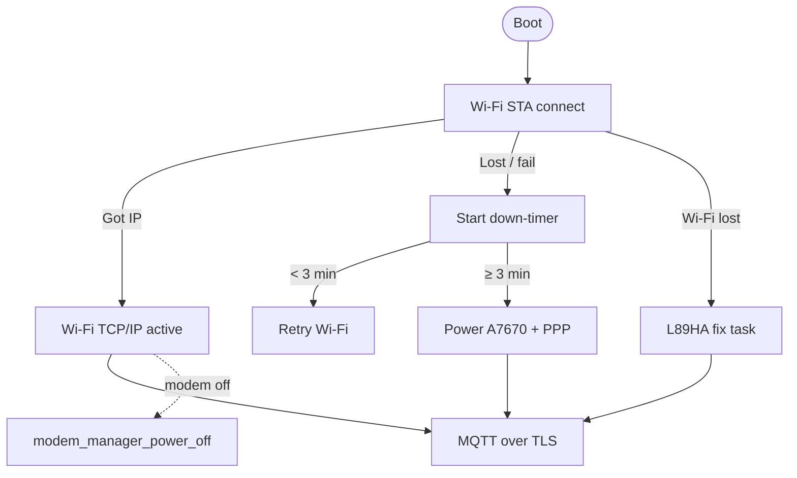

# Connectivity and Cloud Integration

Maps firmware modules to the **KtinosCare Full Architecture Integration Specification v4** and SRS connectivity requirements.

---

## 1. Connectivity policy (firmware)



| SRS ID | Requirement | Firmware location |
|--------|-------------|-------------------|
| FR-9 | Wi-Fi priority | `connectivity_manager.c` |
| FR-10 | LTE when Wi-Fi unavailable | `modem_manager_start_ppp()` after threshold |
| FR-10a | No GNSS/LTE when Wi-Fi connected | `modem_manager_power_off()`, `gps_allowed()` |
| FR-11 | Secure TCP/IP (MQTT/HTTPS) | `cloud_mqtt` (stub), future HTTPS OTA |
| FR-12 | Buffer when offline | `storage_buffer` + `app_telemetry.c` |

---

## 2. Wi-Fi implementation

### Stack

- `esp_netif_create_default_wifi_sta()`
- Event: `WIFI_EVENT_STA_DISCONNECTED` → `esp_wifi_connect()` (auto retry)
- Event: `IP_EVENT_STA_GOT_IP` → `s_connected = true`

### Configuration paths (choose one for production)

| Method | Location | Use case |
|--------|----------|----------|
| Kconfig | `main/Kconfig.projbuild` → `CONFIG_COLLAR_WIFI_SSID` | Lab / CI |
| NVS namespace `collar_cfg` | TODO in `wifi_manager.c` | Field provisioning |
| BLE provisioning | Not implemented | Consumer onboarding |

---

## 3. Cellular PPP (A7670E)

### Hardware control

| Signal | GPIO | Function |
|--------|------|----------|
| `TEMP_VDD` | 26 | Thermistor supply rail |
| `POWER_HOLD` | 23 | Board-level hold / shutdown control |
| `GSM_RST` | 27 | Hardware reset |
| `GSM_TX` / `GSM_RX` | 16 / 17 | UART1 AT + PPP |

A7670E uses `GSM_TX`, `GSM_RX`, and `GSM_RST` only.

### Expected AT flow (to implement)

```text
AT+CGDCONT=1,"IP","<APN>"
ATD*99***1#
→ PPP LCP/IPCP
→ esp_netif attaches PPP interface
```

APN default in Kconfig: `CONFIG_COLLAR_LTE_APN` = `"internet"`.

### Integration with `connectivity_manager`

When PPP obtains IP, mirror Wi-Fi path:

```c
s_has_ip = true;
collar_event_t ppp = { .id = COLLAR_EVT_PPP_CONNECTED };
collar_state_machine_post_event(&ppp, 0);
```

---

## 4. GPS (L89HA)

### When it runs

- State machine enters `GNSS_ACQUISITION` on Wi-Fi disconnect / fail threshold
- `app_telemetry.c` calls `gps_l89_start_task()`
- Task aborts early if `!collar_state_machine_gps_allowed()` (Wi-Fi link active)

### UART

| Parameter | Value |
|-----------|-------|
| Port | `UART_NUM_2` |
| Baud | 9600 |
| TX / RX | GPIO 19 / 18 |
| Reset | GPIO 27 |

### NMEA

Parses `$GNGGA` / `$GPGGA` for fix quality and coordinates.

**TODO:** Convert NMEA ddmm.mmmm → decimal degrees; sync RTC from GPS time field (spec §4.5).

### AGPS (cloud API — not in firmware yet)

Spec §6: `GET /api/v1/devices/{uid}/agps/` → inject almanac to reduce cold-start below 5 s.

---

## 5. MQTT architecture

### Broker parameters (spec §4.1)

| Parameter | Value |
|-----------|-------|
| Port | 8883 (TLS only) |
| Protocol | MQTT 5.0 (EMQX) |
| Auth | mTLS X.509 client certificate |
| Telemetry QoS | 0 |
| Alerts / cmd QoS | 1 |
| Keep-alive | 240 s |

### Topic namespace

Device UID substituted at runtime (`CONFIG_COLLAR_DEVICE_UID` or NVS):

| Direction | Topic pattern | QoS |
|-----------|---------------|-----|
| Publish telemetry | `ktinoskare/device/{uid}/telemetry` | 0 |
| Publish alerts | `ktinoskare/device/{uid}/alerts` | 1 |
| Subscribe commands | `ktinoskare/device/{uid}/cmd` | 1 |
| LWT status | `ktinoskare/device/{uid}/status` | 1, retain, payload `offline` |

**Source:** `components/cloud_mqtt/include/mqtt_topics.h`

### Reconnection (spec §4.3)

Implement exponential backoff with jitter:

```text
delay = min(cap, base * 2^n) + random(0, jitter)
base = 2 s, cap = 15 min
```

Hook in `mqtt_client.c` when replacing stub.

### Last Will and Testament

Register at connect:

- Topic: `MQTT_TOPIC_STATUS_FMT`
- Payload: `offline`
- QoS: 1, retain: true

Broker publishes ~4 minutes after silent disconnect (matches keep-alive).

---

## 6. CSV telemetry schema

### Wire format

- Single line, comma-separated, max **512 bytes**
- Missing sensors = empty fields between commas (preserve indices)
- Timestamp: 10-digit Unix UTC (spec §4.5)

### Field index (spec §4.4)

| Index | Field | Firmware source today |
|-------|-------|----------------------|
| 0 | timestamp | `time()` or `esp_timer` fallback |
| 1 | is_emergency | `collar_state_machine_is_emergency()` |
| 2 | window_seconds | `get_report_interval_sec()` |
| 3–5 | avg/min/max heart rate | `sensor_snapshot_t` |
| 6–8 | SpO2 avg/min/max | Empty (PPG TODO) |
| 9–11 | ambient / object temp | Partial (`avg_skin_temp`) |
| 12–14 | accel x,y,z | `sensor_snapshot_t` |
| 15 | motion_detected | `sensor_snapshot_t` |
| 16 | light_level | `light_lux` |
| 17 | total_steps | `total_steps` |
| 18–19 | battery V, % | `power_status_t` |
| 20–22 | lat, lon, gps_fix_time | `gps_fix_t` |
| 23–25 | DHT temp, humidity, heat index | Empty |
| 26 | rssi | `connectivity_manager_get_rssi()` |

**Builder:** `telemetry_build_csv()` in `components/telemetry/telemetry_csv.c`

### Example line (stub values)

```text
1716567890,0,900,80.0,72.0,88.0,,,,38.2,38.5,0.01,0.02,1.00,0,120,0,3.85,80,0.000000,0.000000,0,,,,-65
```

---

## 7. Cloud commands (downlink)

### Format (spec §4.7)

```json
{"cmd": "set_interval", "val": 900}
```

### Firmware handling (to implement in `cloud_mqtt`)

1. Subscribe to `ktinoskare/device/{uid}/cmd`
2. Parse JSON (cJSON)
3. `collar_event_t evt = { .id = COLLAR_EVT_CLOUD_CMD, .param = val };`
4. `collar_state_machine_post_event(&evt, 0);`
5. ACK publish to alerts topic:

```json
{"timestamp": 1716567890, "ack_cmd": "set_interval", "status": "SUCCESS"}
```

---

## 8. Offline buffering and re-entry

### Spec §4.9

| Rule | Implementation target |
|------|---------------------|
| Store up to 7 days on flash | `storage` SPIFFS partition |
| On reconnect, max 5 historical rows/minute | `app_telemetry.c` flush loop |
| Do not flood broker | `vTaskDelay(60000 / STORAGE_FLUSH_RATE_PER_MIN)` between flushes |

### Current stub flow

```c
if (connectivity_manager_has_ip() && collar_mqtt_is_connected()) {
    while (storage_buffer_pending_count() > 0) {
        storage_buffer_flush_next(csv, ...);
        collar_mqtt_publish_telemetry(csv, hist_len);
        vTaskDelay(pdMS_TO_TICKS(60000 / STORAGE_FLUSH_RATE_PER_MIN));
    }
    collar_mqtt_publish_telemetry(csv, len);  /* live row */
} else {
    storage_buffer_append(csv, len);
}
```

---

## 9. OTA (HTTPS — planned)

Not implemented. Spec §4.8 / §6:

- `POST /api/v1/devices/{uid}/ota/` → `bin_url`, `sha256`
- Stream over HTTPS; verify hash; dual-slot rollback via `ota_0` / `factory` partitions

Use Wi-Fi only for download when possible (SRS FR-24).

---

## 10. Security checklist

| Item | Spec | Status |
|------|------|--------|
| TLS 1.2+ on 8883 | §4.1 | TODO |
| Per-device X.509 in flash | §4.1 | Partition `certs` defined |
| ACL by device UID / IMEI | §4.2 | Broker-side |
| No cleartext MQTT 1883 | §4.1 | Do not enable |
| Secure key storage | SRS §4.4 | Use NVS encrypted or flash encryption |
