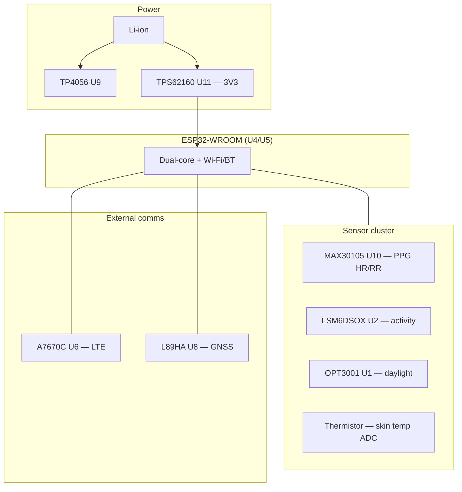

# Hardware Platform

Derived from schematic **PET_COLLAR_1** (`design/final_3.pdf`, V1.0) and SRS §2.1.

---

## 1. Block diagram

---

## 2. MCU — ESP32-WROOM

| Function | Implementation |
|----------|----------------|
| Application processor | FreeRTOS firmware in this repo |
| Wi-Fi STA | Primary TCP/IP |
| I2C master | Sensors at 400 kHz |
| UART1 | A7670 AT/PPP |
| UART2 | L89 NMEA |
| ADC1 | Battery + thermistor |
| Deep sleep | Planned (SRS FR-13) |

---

## 3. Pin map (firmware)

**Authoritative header:** `components/board/include/board_pins.h`

> **Important:** Cross-check every GPIO against the PDF schematic before production. EasyEDA net labels are listed on the symbol; confirm continuity with a DMM if unsure.

### 3.1 I2C bus

| Signal | GPIO | Devices |
|--------|------|---------|
| SDA | 21 | OPT3001, LSM6DSOX, MAX30105 |
| SCL | 22 | (shared) |

| Interrupt | GPIO | Device |
|-----------|------|--------|
| LIGHT_INT | 12 | OPT3001 |
| MEMS_INT | 13 | LSM6DSOX |
| RESP_INT | 14 | MAX30105 |

### 3.2 Modem (A7670C)

| Net (schematic) | GPIO | Direction (ESP) |
|-----------------|------|-----------------|
| GSM_TX | 17 | ESP TX → modem RX |
| GSM_RX | 16 | ESP RX ← modem TX |
| GSM_RST | 5 | Output |
| ESP_VDD_CTRL | 32 | Modem power switch |
| POWER_HOLD | 4 | Hold power latch |

UART: `UART_NUM_1`, 115200 baud.

### 3.3 GNSS (L89HA)

| Net | GPIO |
|-----|------|
| GPS_TX | 19 |
| GPS_RX | 18 |
| GPS_RST | 27 |

UART: `UART_NUM_2`, 9600 baud.

### 3.4 Analog inputs

| Net | GPIO | ADC channel |
|-----|------|-------------|
| TEMP_ADC | 34 | ADC1_CH6 |
| VBAT_ADC | 35 | ADC1_CH7 |
| VBAT_ADC_ON | 33 | Enable divider |

### 3.5 Other

| Net | GPIO |
|-----|------|
| EN_1V8 | 26 |

---

## 4. Sensor details (SRS mapping)

| Part | Interface | Metrics | SRS |
|------|-----------|---------|-----|
| MAX30105 | I2C + RESP_INT | Heart rate, respiration trend | FR-1, FR-2 |
| LSM6DSOX | I2C + MEMS_INT | Activity class, steps, motion wake | FR-3, FR-5, FR-7 |
| OPT3001 | I2C + LIGHT_INT | Ambient lux / daylight | FR-5a |
| NTC thermistor | ADC34 | Skin temperature trend | FR-4 |

### Adaptive sampling (FR-5)

When `motion_detected == false` for extended period:

- Reduce PPG sample rate
- Rely on IMU interrupt for wake
- State machine may use `DEEP_SLEEP` between batches

Implement in `sensor_manager.c` after drivers exist.

---

## 5. Power subsystem

| Stage | Part | Notes |
|-------|------|-------|
| Charger | TP4056 | USB input, charge LED nets |
| 3.3 V rail | TPS62160 | Buck from VBAT |
| Modem supply | Load switch Q1/Q2 | Controlled by `ESP_VDD_CTRL` |
| Battery sense | Divider + ADC | Enabled by `VBAT_ADC_ON` |

### Voltage thresholds (firmware stub)

See `power_manager.c` — align with cell chemistry and divider ratio after calibration.

### Low-battery policy (SRS FR-18)

When `BATTERY_STATE_CRITICAL`:

- Skip scheduled GNSS and non-alarm LTE
- Still allow `EMERGENCY_ALARM` uplink (FR-22)

Post `COLLAR_EVT_BATTERY_CRITICAL` from `power_task` when implementing.

---

## 6. Timing constants

From `board_pins.h`:

| Macro | Value | Use |
|-------|-------|-----|
| `BOARD_WIFI_FAIL_THRESHOLD_MS` | 180000 (3 min) | Wi-Fi → LTE failover |
| `BOARD_GPS_FIX_TIMEOUT_MS` | 120000 (2 min) | GNSS session timeout |
| `BOARD_MODEM_BOOT_MS` | 8000 | After reset release |

---

## 7. Physical / environmental (SRS §2.2)

| Parameter | Range |
|-----------|-------|
| Ambient temperature | 0 °C – 45 °C |
| Environment | Indoor/outdoor pet wearable |

Consider IP rating and antenna placement in mechanical design (out of firmware scope).

---

## 8. Differences vs. SRS text

| SRS mentions | Schematic / firmware |
|--------------|---------------------|
| EC200U-CN modem | **A7670C** on `final_3.pdf` — firmware uses A7670 API |
| EC200U integrated GNSS | **Separate L89HA** — firmware uses L89 when Wi-Fi down |

Document this mismatch for certification and test plans.
