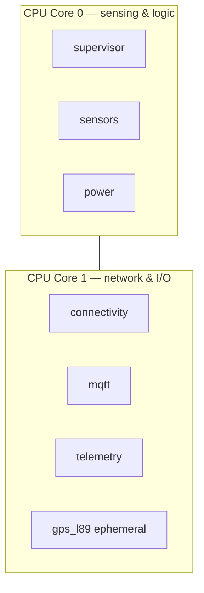
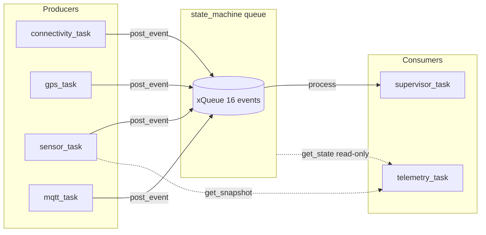
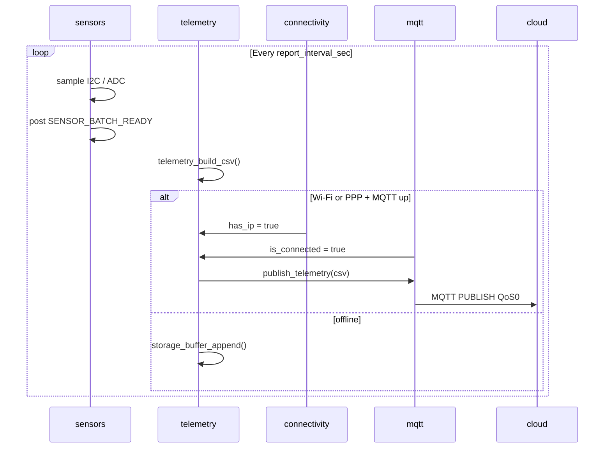

# FreeRTOS Tasks and Scheduling

---

## 1. Task map

| Task name | Entry function | Core | Priority | Stack | Component / file |
|-----------|----------------|------|----------|-------|------------------|
| `supervisor` | `supervisor_task` | 0 | 5 | 4096 | `state_machine/collar_supervisor.c` |
| `connectivity` | `connectivity_task` | 1 | 6 | 6144 | `connectivity/connectivity_manager.c` |
| `mqtt` | `mqtt_task` | 1 | 5 | 8192 | `cloud_mqtt/mqtt_client.c` |
| `sensors` | `sensor_task` | 0 | 4 | 6144 | `sensors/sensor_manager.c` |
| `gps_l89` | `gps_task` | 1 | 4 | 4096 | `gps/gps_l89.c` (created on demand) |
| `power` | `power_task` | 0 | 3 | 3072 | `power/power_manager.c` |
| `telemetry` | `telemetry_task` | 1 | 4 | 6144 | `main/app_telemetry.c` |

Reference header: `main/include/collar_tasks.h`

**Note:** Modem power and PPP are invoked from the `connectivity` task via `modem_manager_*` — there is no dedicated `modem` task yet.

---

## 2. Core affinity rationale



| Core | Workload | Reason |
|------|----------|--------|
| **0** | State machine, sensor sampling, ADC | Keeps I2C/ADC off the same core as Wi-Fi stack heavy lifting |
| **1** | Wi-Fi, MQTT, telemetry upload, GPS UART | Colocate network-facing tasks; reduces cross-core contention with Wi-Fi driver |

Priorities: `connectivity` (6) > `supervisor` / `mqtt` (5) > `sensors` / `telemetry` / `gps` (4) > `power` (3).

---

## 3. Inter-task communication



### 3.1 State machine queue (primary IPC)

- **API:** `collar_state_machine_post_event()` / `collar_state_machine_process()`
- **Thread-safe:** FreeRTOS queue
- **Do not** call `collar_state_machine_process()` from multiple tasks — only `supervisor` drains the queue

### 3.2 Shared data (lock-free reads)

| Data | Writer | Readers | Sync today |
|------|--------|---------|------------|
| `sensor_snapshot_t` | `sensor_task` | `telemetry_build_csv` | Single writer — **add mutex for production** |
| `gps_fix_t` | `gps_task` | `telemetry_build_csv` | Single writer |
| `power_status_t` | `power_task` | `telemetry_build_csv` | Single writer |
| `s_has_ip` | `connectivity_task` | `telemetry`, `mqtt` | Single writer — **add mutex for production** |

**Recommendation:** Add a `collar_data_bus` component with `pthread_mutex` or snapshot copy under mutex before scaling beyond stubs.

---

## 4. Task lifecycle details

### 4.1 `supervisor` — state machine pump

**Start:** `collar_supervisor_start()` from `app_main`

```c
xTaskCreatePinnedToCore(supervisor_task, "supervisor", 4096, NULL, 5, NULL, 0);
```

**Loop:** Posts `COLLAR_EVT_BOOT`, then `collar_state_machine_process(500 ms timeout)` forever.

---

### 4.2 `connectivity` — Wi-Fi and PPP failover

**Period:** 2 s (`vTaskDelay(pdMS_TO_TICKS(2000))`)

**Logic summary:**

1. If `wifi_manager_is_connected()` → `notify_wifi_up()` once, `modem_manager_power_off()`
2. Else → `notify_wifi_down()`, track `s_wifi_down_since_us`
3. If down time ≥ `BOARD_WIFI_FAIL_THRESHOLD_MS` (3 min) → post `WIFI_FAIL_THRESHOLD`, `modem_manager_start_ppp()`, post `PPP_CONNECTED`

**Source:** `components/connectivity/connectivity_manager.c`

---

### 4.3 `mqtt` — session watchdog (stub)

Polls `connectivity_manager_has_ip()` every 5 s. When IP appears, sets `s_connected = true` and posts `COLLAR_EVT_MQTT_CONNECTED`.

**Production:** Replace with `esp_mqtt_client` event handler; keep-alive 240 s per integration spec.

---

### 4.4 `sensors` — periodic sampling (stub)

Delay = `collar_state_machine_get_report_interval_sec() * 1000` ms.

Posts `COLLAR_EVT_SENSOR_BATCH_READY` after updating `s_snap` (placeholder vitals today).

---

### 4.5 `gps_l89` — ephemeral task

Created by `gps_l89_start_task()` when telemetry observes `GNSS_ACQUISITION`.

- Reads UART2 NMEA lines until `$GNGGA`/`$GPGGA` fix or `BOARD_GPS_FIX_TIMEOUT_MS` (120 s)
- Posts `GPS_FIX` or `GPS_TIMEOUT`
- Self-deletes via `vTaskDelete(NULL)`

---

### 4.6 `telemetry` — uplink orchestration

**Start:** `app_telemetry_start()` in `main/app_telemetry.c`

Per iteration:

1. `on_state_change()` — start GPS task or power off modem
2. `telemetry_build_csv()`
3. If IP + MQTT → flush buffered rows (rate-limited), publish live row
4. Else → `storage_buffer_append()`
5. Sleep `report_interval_sec`

---

### 4.7 `power` — battery monitor

Reads ADC every 30 s, updates `s_status`. Future: post `COLLAR_EVT_BATTERY_LOW` / `BATTERY_CRITICAL`.

---

## 5. Timing diagram (normal uplink cycle)



---

## 6. Watchdog and sleep (planned)

| Requirement | SRS | Planned hook |
|-------------|-----|--------------|
| Task watchdog | §4.3 | `esp_task_wdt` subscribe per long-running task |
| Deep sleep | FR-13 | `DEEP_SLEEP` state + `esp_deep_sleep_start()` in supervisor exit callback |
| Modem off idle | FR-14 | Already in `modem_manager_power_off()` |

Not yet implemented in code — document as roadmap items when adding sleep.
