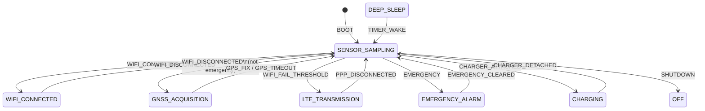

# State Machine Design

The collar firmware uses a **single centralized state machine** with an **event queue**. Tasks and drivers do not change `collar_state_t` directly; they post `collar_event_t` messages.

---

## 1. Source files

| File | Role |
|------|------|
| `components/state_machine/include/collar_states.h` | State and activity enumerations |
| `components/state_machine/include/collar_events.h` | Event IDs |
| `components/state_machine/include/collar_state_machine.h` | Public API |
| `components/state_machine/collar_state_machine.c` | Transitions, queue, link tracking |
| `components/state_machine/collar_supervisor.c` | FreeRTOS task that drains the queue |

---

## 2. States (`collar_state_t`)

Defined in `collar_states.h`, mapped to SRS §5:

```c
typedef enum {
    COLLAR_STATE_OFF = 0,
    COLLAR_STATE_DEEP_SLEEP,
    COLLAR_STATE_SENSOR_SAMPLING,
    COLLAR_STATE_WIFI_CONNECTED,
    COLLAR_STATE_LTE_TRANSMISSION,
    COLLAR_STATE_GNSS_ACQUISITION,
    COLLAR_STATE_EMERGENCY_ALARM,
    COLLAR_STATE_CHARGING,
    COLLAR_STATE_MAX
} collar_state_t;
```

### Orthogonal link state (`collar_link_t`)

Tracks the active TCP/IP bearer separately from the high-level mode:

| Value | Meaning |
|-------|---------|
| `COLLAR_LINK_NONE` | No IP connectivity |
| `COLLAR_LINK_WIFI` | ESP32 STA has IP |
| `COLLAR_LINK_PPP` | Cellular PPP session up |

Updated on `COLLAR_EVT_WIFI_CONNECTED`, `COLLAR_EVT_PPP_CONNECTED`, and disconnect events.

---

## 3. Events (`collar_event_id_t`)

| Event | Typical source | Effect |
|-------|----------------|--------|
| `COLLAR_EVT_BOOT` | `collar_supervisor` at start | → `SENSOR_SAMPLING` |
| `COLLAR_EVT_TIMER_WAKE` | Sleep wake (future) | `DEEP_SLEEP` → `SENSOR_SAMPLING` |
| `COLLAR_EVT_SENSOR_BATCH_READY` | `sensor_manager` | No transition (telemetry uses interval) |
| `COLLAR_EVT_WIFI_CONNECTED` | `connectivity_manager` | `s_link = WIFI`, → `WIFI_CONNECTED` |
| `COLLAR_EVT_WIFI_DISCONNECTED` | `connectivity_manager` | Clear Wi-Fi link, may → `SENSOR_SAMPLING` |
| `COLLAR_EVT_WIFI_FAIL_THRESHOLD` | `connectivity_manager` | → `LTE_TRANSMISSION`, triggers GNSS path |
| `COLLAR_EVT_PPP_CONNECTED` | `connectivity_manager` | `s_link = PPP`, → `LTE_TRANSMISSION` |
| `COLLAR_EVT_PPP_DISCONNECTED` | Modem drop (future) | Clear PPP link |
| `COLLAR_EVT_MQTT_CONNECTED` | `cloud_mqtt` | Reserved |
| `COLLAR_EVT_MQTT_DISCONNECTED` | `cloud_mqtt` | Reserved |
| `COLLAR_EVT_GPS_FIX` | `gps_l89` | `GNSS_ACQUISITION` → `SENSOR_SAMPLING` |
| `COLLAR_EVT_GPS_TIMEOUT` | `gps_l89` | `GNSS_ACQUISITION` → `SENSOR_SAMPLING` |
| `COLLAR_EVT_EMERGENCY` | Safety logic (future) | → `EMERGENCY_ALARM`, interval = 5 min |
| `COLLAR_EVT_EMERGENCY_CLEARED` | Cloud / local clear | → `SENSOR_SAMPLING`, interval = 15 min |
| `COLLAR_EVT_CHARGER_ATTACHED` | Power (future) | → `CHARGING` |
| `COLLAR_EVT_CHARGER_DETACHED` | Power (future) | → `SENSOR_SAMPLING` |
| `COLLAR_EVT_BATTERY_CRITICAL` | `power_manager` (future) | Restrict high-power ops (FR-18) |
| `COLLAR_EVT_CLOUD_CMD` | MQTT cmd handler (future) | `param` = new report interval (seconds) |
| `COLLAR_EVT_SHUTDOWN` | Factory / user | → `OFF` |

Event structure:

```c
typedef struct {
    collar_event_id_t id;
    int32_t param;      /* e.g. set_interval value for CLOUD_CMD */
    void *user_data;
} collar_event_t;
```

---

## 4. State transition diagram



**Note:** After `WIFI_DISCONNECTED` or `WIFI_FAIL_THRESHOLD`, `handle_event()` additionally transitions to `GNSS_ACQUISITION` when not in emergency and Wi-Fi is not the active link (L89HA policy).

---

## 5. Implementation walkthrough

### 5.1 Initialization

```c
esp_err_t collar_state_machine_init(const collar_state_machine_config_t *cfg);
```

- Creates a FreeRTOS queue of depth **16** (`sizeof(collar_event_t)`).
- Stores optional `on_enter` / `on_exit` callbacks.
- Initial state: `COLLAR_STATE_DEEP_SLEEP` (until `BOOT` event).

### 5.2 Posting events (from any task)

```c
esp_err_t collar_state_machine_post_event(const collar_event_t *evt, TickType_t wait_ticks);
```

**Example** — Wi-Fi connected (`connectivity_manager.c`):

```c
collar_event_t evt = { .id = COLLAR_EVT_WIFI_CONNECTED };
collar_state_machine_post_event(&evt, 0);
```

Use `wait_ticks = 0` for non-blocking post from high-priority paths; use `portMAX_DELAY` only at boot.

### 5.3 Processing events (supervisor task only)

```c
esp_err_t collar_state_machine_process(TickType_t wait_ticks);
```

Called in a loop from `supervisor_task` in `collar_supervisor.c`:

```c
for (;;) {
    collar_state_machine_process(pdMS_TO_TICKS(500));
}
```

### 5.4 Transition helper

```c
static collar_state_t transition(collar_state_t next)
{
    if (next == s_state) return s_state;
    collar_state_t prev = s_state;
    if (s_cfg.on_exit) s_cfg.on_exit(prev, next);
    s_state = next;
    ESP_LOGI(TAG, "%s -> %s", collar_state_name(prev), collar_state_name(next));
    if (s_cfg.on_enter) s_cfg.on_enter(prev, next);
    return s_state;
}
```

### 5.5 GNSS side-effect (Wi-Fi down)

At end of `handle_event()`:

```c
if (evt->id == COLLAR_EVT_WIFI_DISCONNECTED || evt->id == COLLAR_EVT_WIFI_FAIL_THRESHOLD) {
    if (s_link != COLLAR_LINK_WIFI && !s_emergency) {
        transition(COLLAR_STATE_GNSS_ACQUISITION);
    }
}
```

The **GPS UART task** is started from `app_telemetry.c` when it observes `GNSS_ACQUISITION` (avoids circular component dependencies).

---

## 6. Reporting interval

Stored in `s_report_interval_sec`, exposed via:

```c
uint32_t collar_state_machine_get_report_interval_sec(void);
void collar_state_machine_set_report_interval_sec(uint32_t sec);
```

| Constant | Seconds | SRS / spec reference |
|----------|---------|----------------------|
| `COLLAR_REPORT_NORMAL_15M` | 900 | DP-1 normal activity |
| `COLLAR_REPORT_REST_30M` | 1800 | DP-2 resting |
| `COLLAR_REPORT_SLEEP_1H` | 3600 | DP-3 sleep hours |
| `COLLAR_REPORT_ANOMALY_5M` | 300 | DP-4 anomaly |

**Used by:**

- `sensor_manager` task delay (batch cadence)
- `telemetry` task delay (uplink cadence)

**Cloud override:** `COLLAR_EVT_CLOUD_CMD` with `evt->param` = interval in seconds (integration spec `set_interval` command).

---

## 7. Policy helpers

```c
bool collar_state_machine_gps_allowed(void);    /* s_link != COLLAR_LINK_WIFI */
bool collar_state_machine_modem_allowed(void);  /* s_link != COLLAR_LINK_WIFI */
bool collar_state_machine_is_emergency(void);
```

`gps_l89` task checks `gps_allowed()` before reading UART.

---

## 8. Adding a new state or event

1. Add enum value to `collar_states.h` or `collar_events.h`.
2. Add case branch in `handle_event()` in `collar_state_machine.c`.
3. Add string to `collar_state_name()` if new state.
4. Post event from the responsible task or ISR (defer ISR work to task).
5. Update this document and [ARCHITECTURE.md](./ARCHITECTURE.md) diagram.
